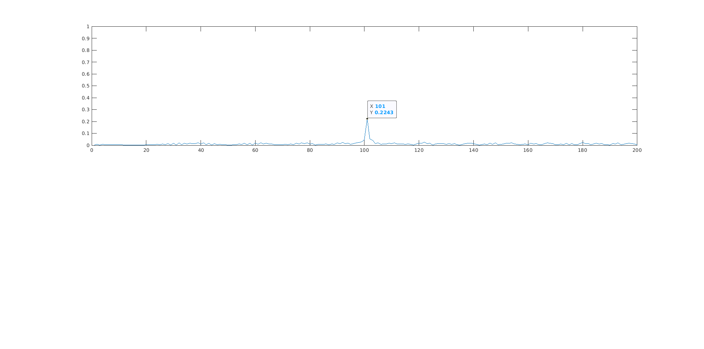
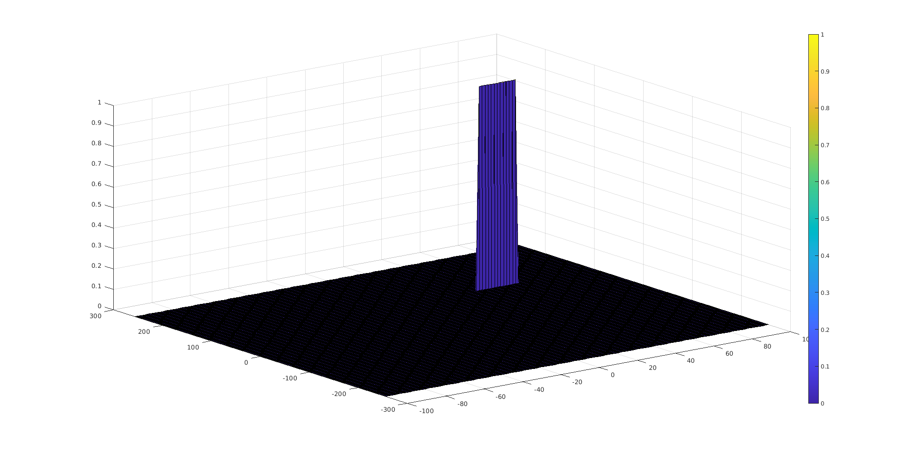

## SFND_radar_target_generation_detection

### Initial setup

I defined the target vehicle to have:

Range: 100m
velocity: 50m/s


### FMCW Waveform Design

Output of calculation of Bandwidth (B), chirp time (Tchirp) and slope of the chirp:
B: 150000000, Tchirp: 7.333333e-06, slope: 2.045455e+13

I.e slope is approx 2e13

### Simulation Loop

below is my implementation of the simulation loop:

```

for i=1:length(t)             
    % *%TODO* :
    %For each time stamp update the Range of the Target for constant velocity.
    % delay time can be calculated from range and speed of light
    r_t(i) = range + v*t(i);
    td(i) = 2*r_t(i)/c;

    % *%TODO* :
    %For each time sample we need update the transmitted and
    %received signal.
    Tx(i) = cos(2*pi*(fc*t(i) + slope*t(i)^2/2));
    Rx(i) = cos(2*pi*(fc*(t(i)-td(i)) + slope*(t(i)-td(i))^2/2));

    % *%TODO* :
    %Now by mixing the Transmit and Receive generate the beat signal
    %This is done by element wise matrix multiplication of Transmit and
    %Receiver Signal
    Mix(i) = Tx(i).*Rx(i);    
end

```

### Range FFT (1st FFT)
with the range of the target set to 100m, the result of the FFT is shown below.


Note that the peak is at 101 rather than 100 taht I defined, but is within the +/-10m requirement.

### 2D CFAR

#### Result plot

The resulting plot from the 2D CFAR is shown below. As you can see it looks similar to the image in the project overview.



#### Implementation

Firstly I created a matrix to hold the result of the 2D CFAR as follows using the zeros method as detailed in https://uk.mathworks.com/help/matlab/ref/zeros.html to create a  matrix with the same size as the RDM, initialised to zeros. This solves the problem of the CFAR not going to the edges of the RDM. Any elements that are not overwritten by the main loop of the CFAR will remain as 0s, and the resultant matrix will be the same size as RDM

```
rdm_size = size(RDM);
disp(rdm_size);
signal_cfar = zeros(rdm_size);
```

I found that its very easy to lose place / track of the positions of the training and guard cells within the sample area and overall RDM when trying to iterate through the rows and columns, in order to sum the noise whilst not including the guard and CUT cells.
Therefore, in order to make the task simpler, or at least easier to visualise, I decided to loop over the rows and columns of the RDM to move the Cell under Test position through the data, but on each loop, in order to reduce the compexity of the indexing, I chose to extract a region of interest that represents the training guard and CUT.

the position of the CUT within this region is defined:

```
cut_col = Gd+Td+1;
cut_row = Gr+Tr+1;
```


Then the main loop:

```
% slide a region of interest / kernel around the radar doppler map
for r_idx=1:(Nr/2 -2*(Gr+Tr))
    for d_idx=1:(Nd-2*(Gd+Td))

        % extract the block of elements containing the  training guard and
        % CUT
        % roi is the region of interest, a window that I slide across the
        % RDM in order to test each cell by sampling the noise
        % CUT is at teh centre of the ROI. ROI is mad up of the training
        % and guard cells in each dimension and CUT
        roi = RDM( r_idx:r_idx+2*(Gr+Tr),d_idx:d_idx+2*(Gd+Td));

        % get the value of the CUT before I start to overwrite the roi
        cut_val = roi(cut_row, cut_col);

        % set the guard and CUT to 0 so that they are not counted in sum to
        % get the noise level
        roi(Tr+1:Tr+1+2*Gr,Td+1:Td+1+(2*Gd)) = 0;

        % note that sum only return a vetcor of the column sums, so need
        % to do sum(sum()) in order to get all
        noise_level = sum(sum(db2pow(roi)));
        mean_of_t_cells = noise_level/num_t_cells;
        threshold = pow2db(mean_of_t_cells*offset);
        %         fprintf("r_idx: %u, d_idx: %u, sum: %u, mean: %d, threshold: %f\n", r_idx, d_idx,noise_level, mean_of_t_cells, threshold);

        if (cut_val<threshold)
            cut_val =0;
        else
            cut_val =1;
        end
        % insert the thresholded value into the results matrix
        signal_cfar(r_idx+cut_row, d_idx+cut_col) = cut_val;
    end
end
```

Note that the code that controls the loop:
```
for r_idx=1:(Nr/2 -2*(Gr+Tr))
    for d_idx=1:(Nd-2*(Gd+Td))
```
will result in RDM(r_idx, d_idx) being the position of the top left corner of the region of interest, so the element containing the CUT will be referenced relative to this point.

The code below extracts a region of interest (training, guard and CUT)   
```
        roi = RDM( r_idx:r_idx+2*(Gr+Tr),d_idx:d_idx+2*(Gd+Td));
```


The code below sets the guard and CUT to 0, so that a sum of the roi matrix will be only the training cells. I found this must simpler than trying to define the logic to only add the training cells by defining individual ranges to evaluate.

```
        roi(Tr+1:Tr+1+2*Gr,Td+1:Td+1+(2*Gd)) = 0;
```

The noise_level, mean and threshold can now be calcuated simply:
```
noise_level = sum(sum(db2pow(roi)));
mean_of_t_cells = noise_level/num_t_cells;
threshold = pow2db(mean_of_t_cells*offset);
```

Note the conversion from and to dB.

Finally the CUT is compared against the threshold and the result set in the output matrix:

```
if (cut_val<threshold)
    cut_val =0;
else
    cut_val =1;
end
% insert the thresholded value into the results matrix
signal_cfar(r_idx+cut_row, d_idx+cut_col) = cut_val;
```

#### Selection of number of training, guard cells and offset.

I used the following values initially:

Tr = 8
Td = 4;
Gr = 4;
Gd = 2;

Purely because these were the values used in the CFAR lession quiz.
I orginally had offset set to 1, but found that the noise was greater that the threshold value so produced a plot full of noise.

I found that with offset set to 4, I would eliminate all but a few occurances of noise, but the more I increase the value narrowed the variance of the resultant vehicle speed estimation.
I ultimately ended with:

Tr = 12
Td = 8;
Gr = 6;
Gd = 4;
offset = 12;
